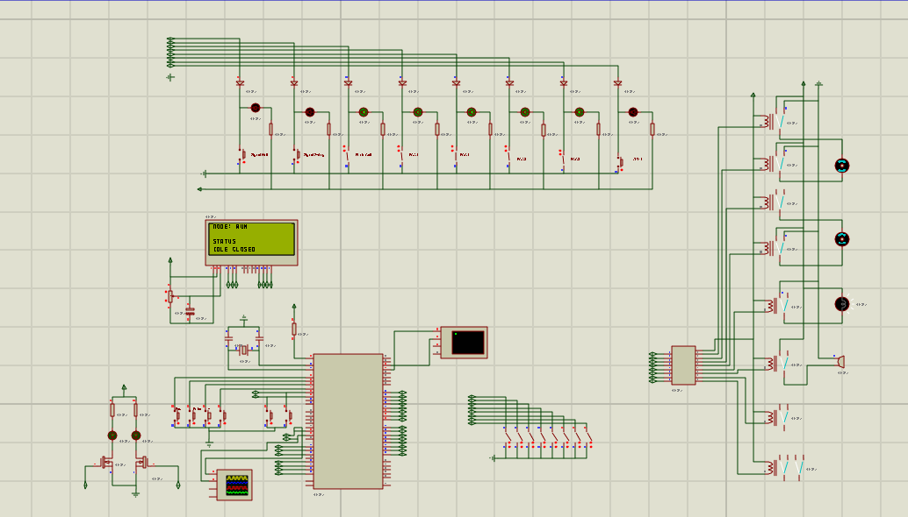

## Synopsis

Double Swing Gate Control with power control for the 230V actuators.  
The timmings and modes are programmed in the user buttons (ENTER, ESC, +, -)  
Modes (Pre-Flashing, RAM, Auto Close, Step Mode, Cell Active, etc.
## Features 

User can specify the power of the actuators and change the triac fire angle using an opto resistor and change different timmings.  

## Videos/Images

Proteus schematics.  

## Contributors

Main Developer :HSO  
Email: hugo(dot)soares(at)fe(dot)up(dot)pt
